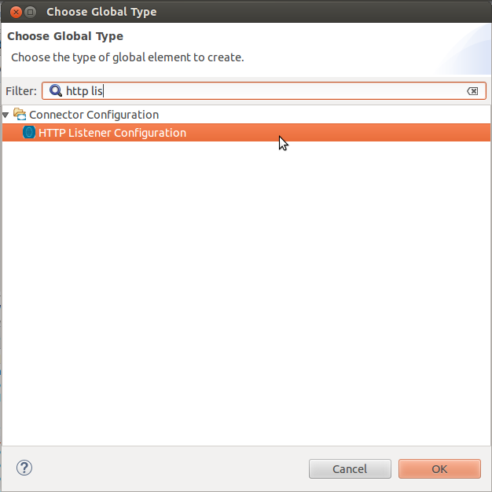
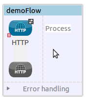
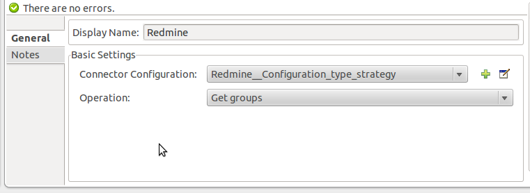
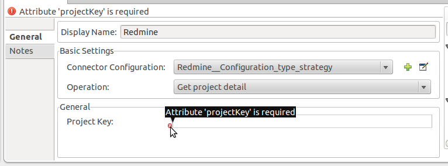
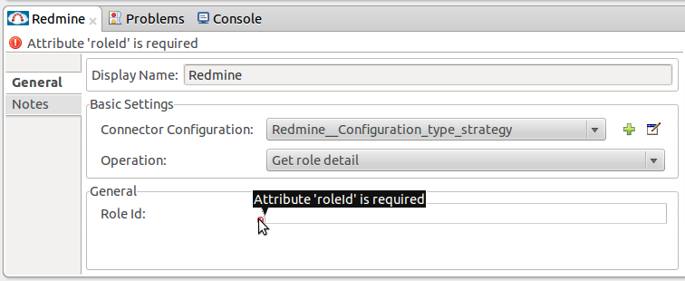
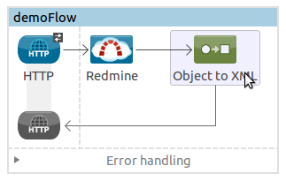
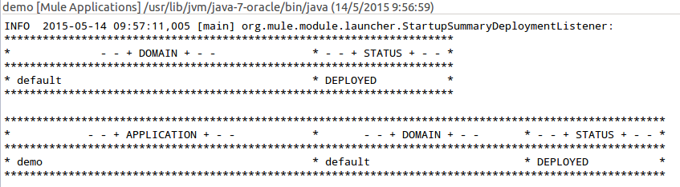
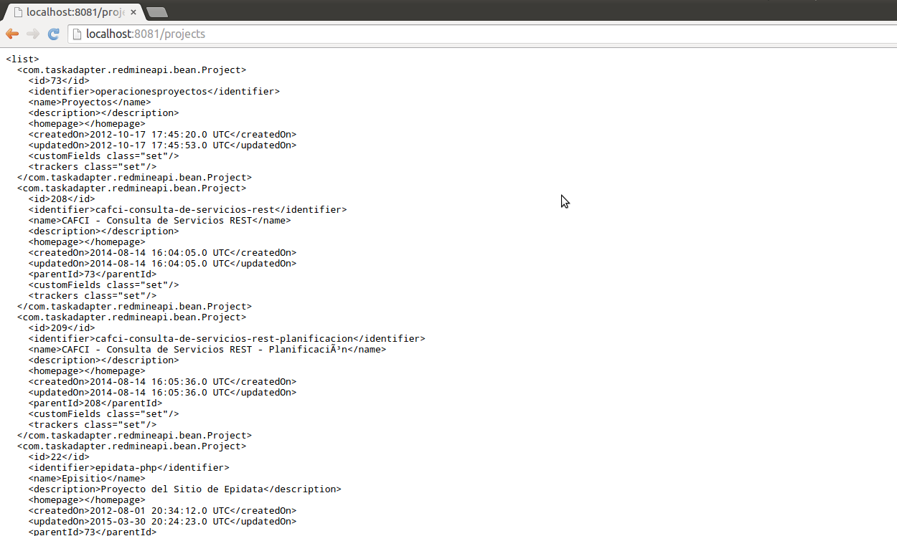

[Purpose](#purpose)  

[Prerequisites](#prerequisites)  

[Step 1: Install Redmine Connector](#step-1-install-redmine-***REMOVED***)    

[Step 2: Create Demo project](#step-2-create-demo-project)   

[Step 3: Add Global Elements](#step-3-add-global-elements)  

[Step 4: Create a New Flow](#step-4-create-a-new-flow)   

[Step 4.1: Get available properties flow](#step-4-1-get-available-properties-flow)   

[Step 4.2: Get group detail flow](#step-4-2-get-group-detail-flow)   

[Step 4.3: Get groups flow](#step-4-3-get-groups-flow)   

[Step 4.4: Get project detail flow](#step-4-4-get-project-detail-flow)   

[Step 4.5: Get project issues flow](#step-4-5-get-project-issues-flow)   

[Step 4.6: Get project members flow](#step-4-6-get-project-members-flow)   

[Step 4.7: Get role detail flow](#step-4-7-get-role-detail-flow)   

[Step 4.8: Get roles flow](#step-4-8-get-roles-flow)   

[Step 4.9: Get user detail flow](#step-4-9-get-user-detail-flow)   

[Step 4.10: Get users flow](#step-4-10-get-users-flow)   

[Step 5: Add an Object to XML transformer](#step-5-add-an-object-to-xml-transformer)    

[Step 6: Run Demo project](#step-6-run-demo-project)      

[Other Resources](#other-resources)    

### Purpose

This document provides detailed instructions on how to install Redmine ***REMOVED*** and demonstrates how to build and run simple demo application that uses this ***REMOVED***.

### Prerequisites

In order to build and run this project you'll need:

* [Anypoint Studio](https://www.mulesoft.com/platform/mule-studio).

*  Java 7: Redmine ***REMOVED*** does not work unless you are using Java 1.7.0_x as your JRE. 

* Web browser.

*  A project configuration in Redmine: Configuring the Redmine ***REMOVED*** requires configuring a Project configured in Redmine, and provide the valid credentials to set the connection strategy of this ***REMOVED***: an URI and API access key. As optional parameters, you can set the username and the password to access the Redmine instance.

### Step 1: Install Redmine Connector

Because this is a ***REMOVED*** in the beta version, you can download the source code cloning the source code from:  [GitHub Repository](https://github.com/EpidataSA/redmine-***REMOVED***.git) and build it with Anypoint Connector DevKit to find it available on your local repository. Then you can add it to Anypoint Studio following the next steps:

* In **Anypoint Studio**, to import an existing ***REMOVED*** project, click **File \> Import \> Anypoint Studio \> Anypoint Connector Project from External Location**, browse the path location where you have the root directory for the Redmine Connector and complete the wizard to locate and import the project.

* Click to accept terms and conditions of the product, then click **Finish**.

* Click **Restart Now** to complete the installation. After you install the ***REMOVED*** and restart Studio, the Redmine ***REMOVED*** is available in the palette in the Connectors category.

### Step 2: Create Demo project

*    Run Mule Studio and select **File \> New \> Mule Project** menu item.  

*    Type **Demo** as a project name, accept default values on this screen of project creation wizard and click **Finish**.

### Step 3: Add Global Elements   

*    Double click on **src/main/app/Demo.xml** to open it, select **Global Elements** tab in view.

 

Add two Global Elements.  

*    Click on **Create** button and add **HTTP Listener Configuration** to the configuration.   

*    In HTTP Listener Configuration set a name for this HTTP Listener Configurator, set **localhost** on the **Host** field, and set in your **port** field the value **8081**. Finally accept the default values as you can see in the following image:

*       Similarly, add **Redmine: Configuration type strategy**.

*       In the **general** tab, set the Redmine Configuration type strategy parameters according to your Redmine account configuration:

Field | Description
------------ | -------------
**Name:** | Enter a name you prefer.
**Username (Optional):** | Enter your Redmine username.
**Password (Optional):** | Enter your Redmine password.
**Uri:** | Enter the URL of your Redmine instance.
**Api Access Key:** | Enter the access key of your Redmine.instance.

*       Click on the **Test Connection** button to confirm that Mule can connect with the Redmine instance. If the connection is successful, click OK to save the configurations. If unsuccessful, revise or correct any incorrect parameters, then test again.

### Step 4. Create a new flow.

*       Add **HTTP Endpoint** to your flow by dragging it from the palette. 
This action drops an HTTP Listener in a new flow. You can change the name of this flow by right-clicking on flow's header and selecting **Rename** from context menu.  

*       Set the **HTTP Endpoint** ***REMOVED*** configuration with the global property previously configured and write a path for the URL of this endpoint and accept the default values of the other settings: 

*       Add **Redmine Connector** to the flow by dragging it from the palette. 

*       Click it to show ***REMOVED*** properties and select **Redmine_Configuration_type_strategy** in **Connector Configuration** drop-down.

*       We need to select an operation for this ***REMOVED***, we start showing you an example of each operation of this ***REMOVED*** using the configuration defined before.

### Step 4.1. Get available properties flow.

*       Select **Get Available Projects** in the **Operation** configuration. This operation will get a collection of all the project of the Redmine instance configured previously.

*   Follow the [Step 5](#step-5-add-an-object-to-xml-transformer) and [Step 6](##step-6-run-demo-project) to show the data in XML format and run the project.

### Step 4.2: Get group detail flow.

*       Select **Get Group Detail** in the **Operation** configuration. This operation will return an object of the group especified by the group Id of the Redmine instance configured previously. Note that you must set a group Id to get the group detail and this must correspond to an existing group Id in the instance, else the request send and error message notifing that the source was not found.

*   Follow the [Step 5](#step-5-add-an-object-to-xml-transformer) and [Step 6](##step-6-run-demo-project) to show the data in XML format and run the project.

### Step 4.3: Get groups flow.

*       Select **Get Groups** in the **Operation** configuration. This operation will get a collection of all the groups of the Redmine instance configured previously.

*   Follow the [Step 5](#step-5-add-an-object-to-xml-transformer) and [Step 6](##step-6-run-demo-project) to show the data in XML format and run the project.

### Step 4.4: Get project detail flow.

*       Select **Get Project Detail** in the **Operation** configuration. This operation will return an object of the project especified by the project key of the Redmine instance configured previously. Note that you must set a project key to get the project detail and this must correspond to an existing project key in the instance, else the request send and error message notifing that the source was not found.

*   Follow the [Step 5](#step-5-add-an-object-to-xml-transformer) and [Step 6](##step-6-run-demo-project) to show the data in XML format and run the project.

### Step 4.5: Get project issues flow.

*       Select **Get Project Issues** in the **Operation** configuration. This operation will return a collection of the issues of an existing project especified by the project key of the Redmine instance configured previously. Note that you must set a project key to get the project detail and this must correspond to an existing project key in the instance, else the request send and error message notifing that the source was not found.

*   Follow the [Step 5](#step-5-add-an-object-to-xml-transformer) and [Step 6](##step-6-run-demo-project) to show the data in XML format and run the project.

### Step 4.6: Get project members flow.

*       Select **Get Project Members** in the **Operation** configuration. This operation will return a collection of the members involved in existing project especified by the project key of the Redmine instance configured previously. Note that you must set a project key to get the project detail and this must correspond to an existing project key in the instance, else the request send and error message notifing that the source was not found.

*   Follow the [Step 5](#step-5-add-an-object-to-xml-transformer) and [Step 6](##step-6-run-demo-project) to show the data in XML format and run the project.

### Step 4.7: Get role detail flow.

*       Select **Get Role Detail** in the **Operation** configuration. This operation will return an object of the role especified by the role ID of the Redmine instance configured previously. Note that you must set a role ID to get the role detail and this must correspond to an existing role in the instance, else the request send and error message notifing that the source was not found.

*   Follow the [Step 5](#step-5-add-an-object-to-xml-transformer) and [Step 6](##step-6-run-demo-project) to show the data in XML format and run the project.

### Step 4.8: Get roles flow.

*       Select **Get Roles** in the **Operation** configuration. This operation will get a collection of all the roles of the Redmine instance configured previously.

*   Follow the [Step 5](#step-5-add-an-object-to-xml-transformer) and [Step 6](##step-6-run-demo-project) to show the data in XML format and run the project.

### Step 4.9: Get user detail flow.

*       Select **Get User Detail** in the **Operation** configuration. This operation will return an object of the user especified by the user ID of the Redmine instance configured previously. Note that you must set a user ID to get the user detail and this must correspond to an existing user in the instance, else the request send and error message notifing that the source was not found.

*   Follow the [Step 5](#step-5-add-an-object-to-xml-transformer) and [Step 6](##step-6-run-demo-project) to show the data in XML format and run the project.

### Step 4.10: Get users flow.

*       Select **Get Users** in the **Operation** configuration. This operation will get a collection of all the users of the Redmine instance configured previously.

*   Follow the [Step 5](#step-5-add-an-object-to-xml-transformer) and [Step 6](##step-6-run-demo-project) to show the data in XML format and run the project.

### Step 5: Add an Object to XML transformer

*       Add **Object to XML** transformer to the flow by dragging it from the palette. It will show the payload of the flow in XML format.

### Step 6: Run Demo project

*     In **Package Explorer** window, right Click on your mule project **demo \> Run As/Mule Application**.

*     Check the console to see when the application starts. If the application starts succesfully, you will see that the application was deployed as you can see in this image, else check the flow configuration again following the previously steps:

*     Finally check the results in your favorite browser, opening an URL according to the path defined in the HTTP Endpoints of the operations defined previously: 
**http://localhost:8081/<path of the operation>**. The final flow XML should look like that:

*    Stop mule server by clicking **Terminate** icon in console.

### Other Resources

For more information on:

- Mule AnyPoint™ ***REMOVED***s, please visit [http://www.mulesoft.org/***REMOVED***s](http://www.mulesoft.org/***REMOVED***s)

- Mule platform and how to build Mule apps, please visit [http://www.mulesoft.org/documentation/display/current/Home](http://www.mulesoft.org/documentation/display/current/Home)